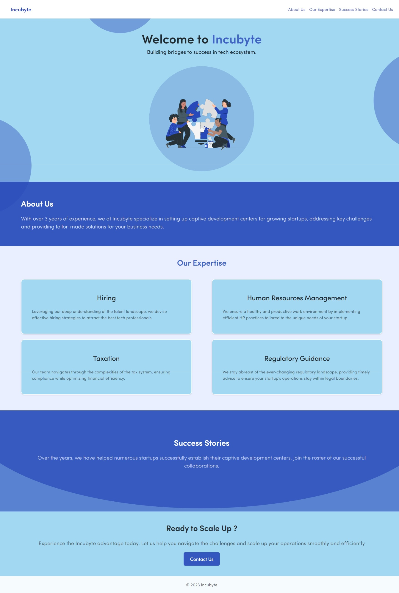

# Webmobi | Incubyte Website 
[Live Website Link | Hosted on Netlify](https://webmobi-ifaiz.netlify.app/)

## Installation

1. Clone the repository: `https://github.com/faizi-7/web-mobi.git`
2. Navigate to the project directory: `cd web-mobi`
3. Install the dependencies: `npm install`

## Usage

1. Start the development server: `npm run dev`
2. Open your browser and visit: `http://localhost:5173`

## Screenshots

## Contributing

Contributions are welcome! If you have any ideas or suggestions, feel free to open an issue or submit a pull request.

## License

This project is licensed under the [MIT License](https://opensource.org/licenses/MIT).

## Contact

For more information or inquiries, please contact us at [faiziqbal733@gmail.com](mailto:faiziqbal733@gmail.com).

